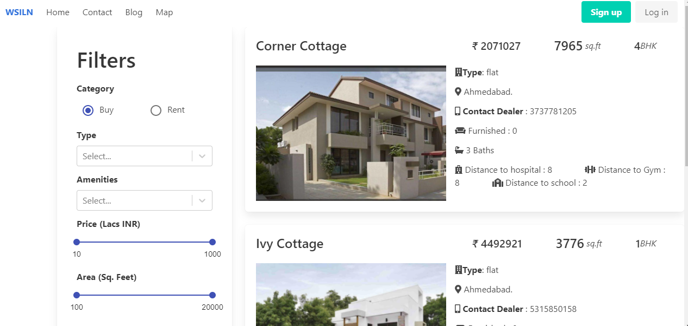
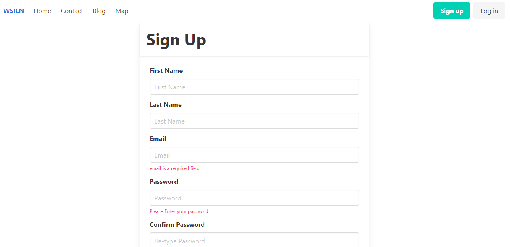
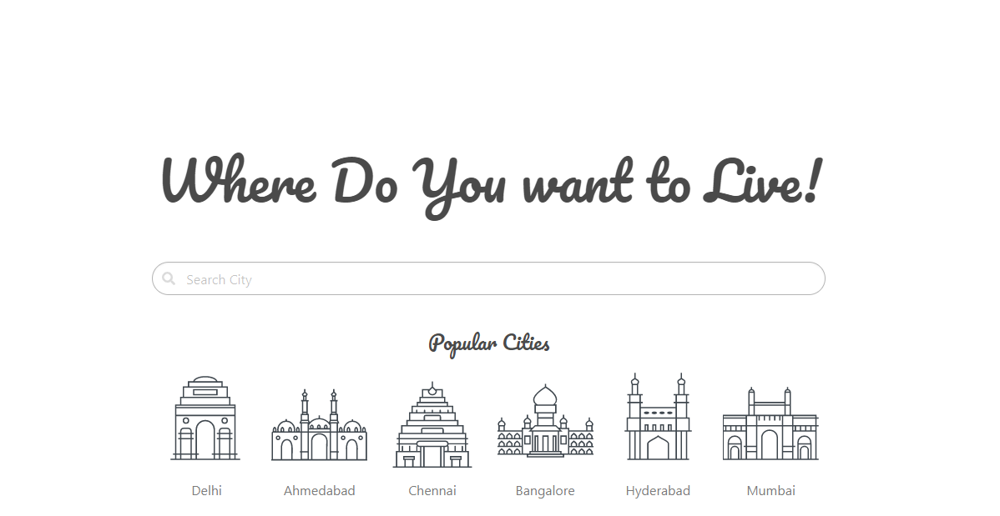
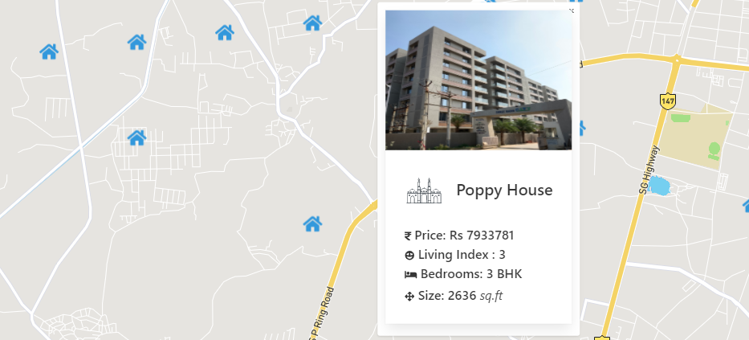

This is a MERN(MySQL - Express - React - Node) stack housing search application. This is only a POC(Proof of Concept), and not a full fledged app.

It allows user to view properties, sign up/login, save them to view later, write reviews, search, filter based on various categories, view the locations on map, read blogs on real estate and more.

The app is fully responsive, built using Bulma CSS and has been end to end tested using Cypress and Jest.

Here are some snapshots of the app : 

